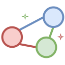
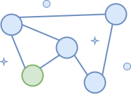
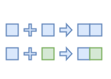
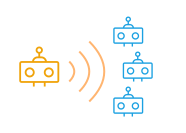
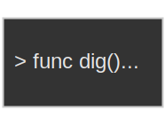
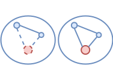

# RoboCivix

- [RoboCivix](#robocivix)
- [What is RoboCivix](#what-is-robocivix)
	- [Civilization Simulation Overview](#civilization-simulation-overview)
	- [Immutable Historical Record](#immutable-historical-record)
	- [Simplicity and Emergence](#simplicity-and-emergence)
	- [Dynamic Social Structures](#dynamic-social-structures)
	- [Creative World Building](#creative-world-building)
	- [Eternal Operation](#eternal-operation)
- [Next](#next)

# What is RoboCivix
RoboCivix is a simulation that forms a universe of interconnected civilizations, each crafted by individual contributors. It's defined by its evolving history, shaped by the interactions between these unique worlds. Once part of RoboCivix, a world's history becomes permanent, contributing to the universe's immutable past.

At its core, RoboCivix operates on simple yet powerful fundamental rules, from which complex social behaviors and civilizations emerge organically, without predetermined outcomes. Contributors, acting as the architects of their worlds, steer their civilizations by programming the actions and decisions of robots, navigating towards unforeseen futures.

Designed to operate indefinitely on a decentralized network, RoboCivix ensures continuity and growth through the collective engagement of its contributors, making it a perpetually live universe.

## Civilization Simulation Overview

RoboCivix embodies a universe where simulated civilizations, created by contributors, interact and evolve together.

  

## Immutable Historical Record

History within RoboCivix is crafted through the interactions of its worlds, solidifying into a permanent and unchangeable record once formed.

  

## Simplicity and Emergence

With foundational rules that are both simple and encompassing, RoboCivix fosters the emergence of complex social behaviors and civilizations, unpredictably evolving from these basic principles.

  

## Dynamic Social Structures

The system's fundamental rules encourage the spontaneous development of social hierarchies and interactions, leading to a rich tapestry of outcomes that defy prediction.

  

## Creative World Building

Contributors shape their own worlds within RoboCivix, programming robots to cultivate civilizations that endure and interact within the ever-expanding universe.

  

## Eternal Operation 

Aimed to persist indefinitely, RoboCivix thrives on a decentralized network, ensuring its continuity as long as contributor nodes remain active.

  

# Next
<a href="https://robocivix.github.io">Home page</a>
